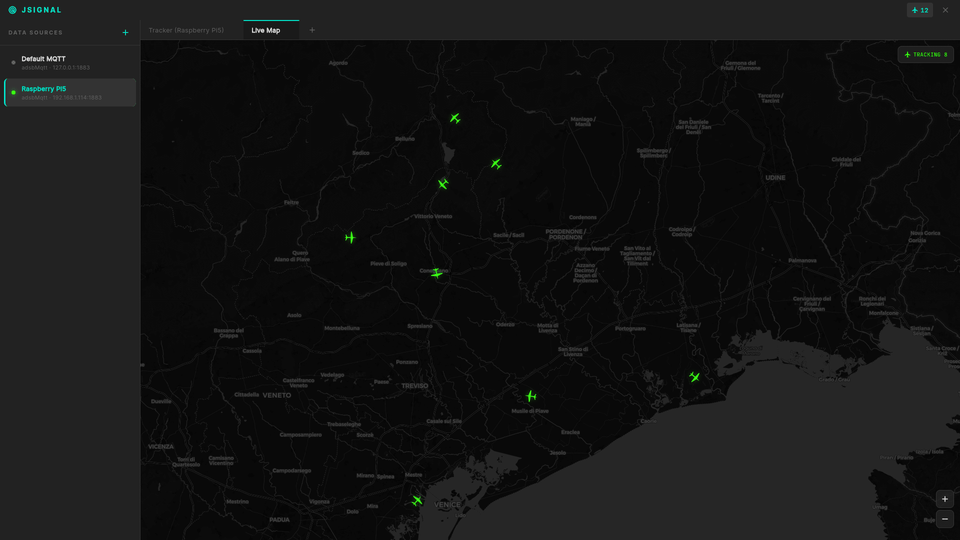

# adsb-module

ADS-B receiver and decoder that captures Mode S transponder signals from aircraft using an RTL-SDR dongle, decodes them in real time, and publishes structured JSON data to an MQTT broker.


*Demo of an unreleased frontend*

## Dependencies

| Library | Purpose |
|---------|---------|
| [rtl-sdr](https://osmocom.org/projects/rtl-sdr/wiki) | RTL-SDR device driver |
| [paho.mqtt.c](https://github.com/eclipse/paho.mqtt.c) | MQTT C client |
| [paho.mqtt.cpp](https://github.com/eclipse/paho.mqtt.cpp) | MQTT C++ client |
| [yaml-cpp](https://github.com/jbeder/yaml-cpp) | YAML configuration parsing |
| [nlohmann/json](https://github.com/nlohmann/json) | JSON serialization |
| [adsb-cpp-lib](https://github.com/jaggornaut/adsb-cpp-lib) | ADS-B message decoding |

## Build

```bash
git clone --recurse-submodules https://github.com/jaggornaut/adsb-module.git
cd adsb-module
mkdir build && cd build
cmake ..
make
```

## Configuration

Copy the example config and edit it with your position and MQTT broker address:

```bash
mkdir -p ~/.config/jsignal
cp config.example.yaml ~/.config/jsignal/adsb-module.yaml
```

Edit `~/.config/jsignal/adsb-module.yaml`:

```yaml
sdr_settings:
  device_index: 0
  center_frequency: 1090000000   # 1090 MHz (ADS-B frequency)
  sample_rate: 2000000           # 2 Msps
  tuner_gain: 496                # gain in tenths of dB
  ref_position:
    latitude: 0.0               # your latitude
    longitude: 0.0              # your longitude

mqtt_settings:
  broker_address: "tcp://127.0.0.1:1883"
  client_id: "adsb_processor_instance"
  topic_base: "adsb/aircraft/"
```

The reference position is used for CPR (Compact Position Reporting) decoding to resolve aircraft coordinates.

## Usage

### Native

```bash
./adsb-module ~/.config/jsignal/adsb-module.yaml
```

### Docker Compose

The RTL-SDR dongle must be plugged in before starting. An external MQTT broker must be reachable at the address configured in `broker_address`.

#### Quick deploy (pre-built image)

No need to clone the repo. Download the required files and run:

```bash
mkdir -p adsb-module/config && cd adsb-module
curl -LO https://raw.githubusercontent.com/jaggornaut/adsb-module/main/docker-compose.yaml
curl -LO https://raw.githubusercontent.com/jaggornaut/adsb-module/main/config.example.yaml

cp config.example.yaml config/adsb-module.yaml
nano config/adsb-module.yaml   # set your coordinates and broker_address

docker compose up -d
```

#### Build from source

If you cloned the repo:

```bash
cp config.example.yaml config/adsb-module.yaml
nano config/adsb-module.yaml   # set your coordinates and broker_address

docker compose up -d --build
```

### Listening to MQTT messages

To test the output published on the MQTT topic, subscribe with `mosquitto_sub`:

```bash
mosquitto_sub -h 127.0.0.1 -t adsb/aircraft/# -v
```

Each decoded aircraft is published to `adsb/aircraft/<ICAO>` as JSON:

```json
{
  "icao": "4B1A3F",
  "callsign": "SWR162",
  "latitude": "12.341234",
  "longitude": "12.234765",
  "altitude_barometric_ft": 36000,
  "ground_speed_kts": "452.30",
  "heading_deg": "127.85",
  "vertical_rate_fpm": -64,
  "last_seen_ms": 1234567890
}
```
